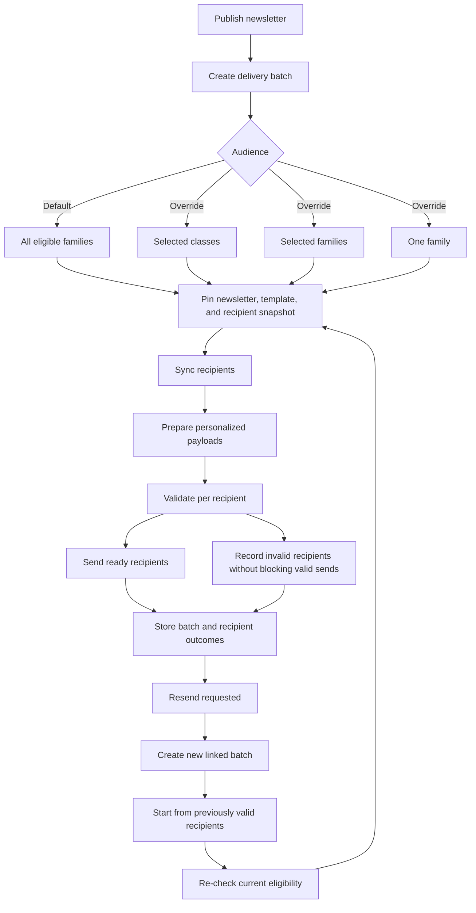

# newsletter-delivery-workflow Specification

## Purpose

Model publish-triggered newsletter delivery as batches with pinned inputs, local eligibility-based recipient resolution, per-recipient outcomes (including partial success), and resend as new linked batches with revalidation and audience narrowing.

## Mental Model

## Requirements

### Requirement: Publishing creates a delivery batch with default send-to-all behavior
The system SHALL create a newsletter delivery batch when a valid draft newsletter is published, targeting all eligible families by default unless the admin explicitly narrows the audience before confirmation.

#### Scenario: Publish defaults to all eligible families
- **WHEN** an admin publishes a valid draft newsletter without changing audience controls
- **THEN** the system SHALL create a delivery batch whose audience mode is `all` and whose recipient set is all currently eligible families for that newsletter

#### Scenario: Publish narrows audience to selected classes
- **WHEN** an admin publishes a valid draft newsletter after selecting one or more classes as the audience override
- **THEN** the system SHALL create a delivery batch containing only families resolved from those selected classes

#### Scenario: Publish narrows audience to selected families
- **WHEN** an admin publishes a valid draft newsletter after selecting one or more families as the audience override
- **THEN** the system SHALL create a delivery batch containing only those selected families that are currently eligible

#### Scenario: Publish narrows audience to one family
- **WHEN** an admin publishes a valid draft newsletter after selecting one specific family as the audience override
- **THEN** the system SHALL create a delivery batch containing only that family if it is currently eligible

### Requirement: Delivery batches use pinned inputs and local recipient snapshots
The system SHALL pin newsletter content, template revision, and recipient snapshot inputs for each delivery batch before preparation starts, and SHALL resolve recipient eligibility from CMS-local data rather than provider-side segments.

#### Scenario: Batch captures immutable preparation inputs
- **WHEN** a delivery batch begins preparation
- **THEN** the system SHALL persist pinned references to the newsletter revision, template revision, and recipient snapshot used for that batch

#### Scenario: Recipient targeting comes from local eligibility data
- **WHEN** the system resolves recipients for a delivery batch
- **THEN** the system SHALL determine the audience from local family, enrollment, and subscription state instead of relying on provider-managed tags as the source of truth

### Requirement: Delivery preparation and send allow partial success
The system SHALL prepare, validate, and send newsletter content on a per-recipient basis so invalid recipients do not block delivery to valid recipients in the same batch.

#### Scenario: Valid recipients send even when some recipients fail validation
- **WHEN** a delivery batch contains a mix of valid and invalid recipients during preparation
- **THEN** the system SHALL keep valid recipients in a ready-to-send state and SHALL record invalid recipients with explicit failure reasons

#### Scenario: Publish-triggered batch starts preparation and send automatically
- **WHEN** a delivery batch is created from a successful publish action
- **THEN** the system SHALL automatically start recipient sync, content preparation, and provider handoff for recipients whose prepared payloads are ready

#### Scenario: Batch outcome remains visible after partial failure
- **WHEN** one or more recipients in a delivery batch fail preparation or delivery while others succeed
- **THEN** the system SHALL preserve aggregate batch counts and per-recipient statuses so operators can review what succeeded and what failed

### Requirement: Resend creates a new linked delivery batch
The system SHALL model resend as a new delivery batch linked to a prior batch, using previously valid recipients as the candidate set and re-checking current validity before sending.

#### Scenario: Resend references the original batch
- **WHEN** an admin requests a resend from a prior delivery batch
- **THEN** the system SHALL create a new delivery batch that stores a reference to the original batch rather than mutating historical send records

#### Scenario: Resend re-checks recipient validity
- **WHEN** the system creates a resend batch from previously valid recipients
- **THEN** the system SHALL exclude recipients who are no longer eligible, active, or subscribed at resend time

#### Scenario: Resend can target a narrowed subset
- **WHEN** an admin requests a resend and further narrows the audience to selected classes, selected families, or one family
- **THEN** the system SHALL intersect that narrowed audience with the eligible resend candidate set before preparation and delivery
