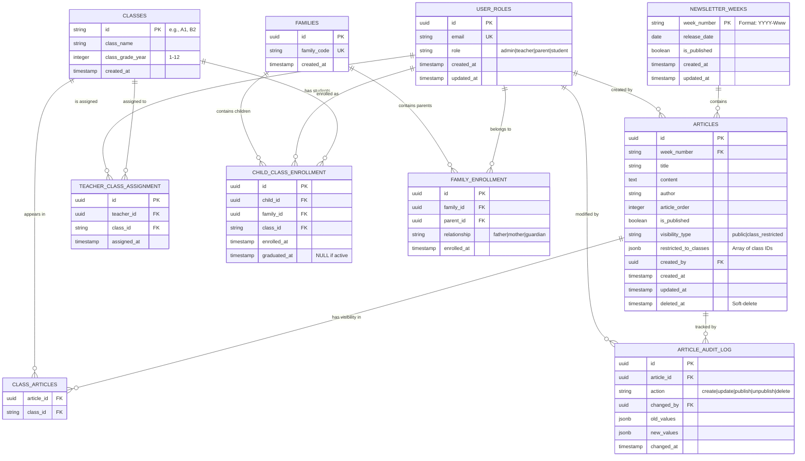

# Entity-Relationship Diagram (ERD)
## CMS Database Structure

**Feature**: 002-database-structure
**Date**: 2025-11-17
**Format**: Mermaid ERD + ASCII Alternative

---

## Mermaid ERD Diagram



---

## ASCII ERD Diagram

```
┌─────────────────────────────────────────────────────────────────────────┐
│                         CORE ENTITIES                                   │
└─────────────────────────────────────────────────────────────────────────┘

┌──────────────────────────────┐
│    NEWSLETTER_WEEKS          │
├──────────────────────────────┤
│ week_number (PK)             │
│ release_date                 │
│ is_published                 │
│ created_at                   │
│ updated_at                   │
└──────────────────────────────┘
          │
          │ 1:N
          │
          ▼
┌──────────────────────────────┐
│        ARTICLES              │
├──────────────────────────────┤
│ id (PK, UUID)                │
│ week_number (FK)             │
│ title                        │
│ content (Markdown)           │
│ author                       │
│ article_order                │
│ is_published                 │
│ visibility_type              │
│ restricted_to_classes (JSON)│
│ created_by (FK)              │
│ created_at                   │
│ updated_at                   │
│ deleted_at (Soft-delete)    │
└──────────────────────────────┘
          │
          │ N:M (via JSON array)
          │
          ▼
┌──────────────────────────────┐
│        CLASSES               │
├──────────────────────────────┤
│ id (PK, VARCHAR)             │
│ class_name                   │
│ class_grade_year (1-12)      │
│ created_at                   │
└──────────────────────────────┘

┌─────────────────────────────────────────────────────────────────────────┐
│                    ACCESS CONTROL                                       │
└─────────────────────────────────────────────────────────────────────────┘

┌──────────────────────────────┐
│      USER_ROLES              │
├──────────────────────────────┤
│ id (PK, UUID)                │
│ email (UNIQUE)               │
│ role (enum)                  │
│ created_at                   │
│ updated_at                   │
└──────────────────────────────┘
   ▲                  ▲
   │ 1:N              │ 1:N
   │                  │
   │                  │
┌──────────────────────────────┐     ┌──────────────────────────────┐
│ TEACHER_CLASS_ASSIGNMENT     │     │ FAMILY_ENROLLMENT            │
├──────────────────────────────┤     ├──────────────────────────────┤
│ id (PK)                      │     │ id (PK)                      │
│ teacher_id (FK → USER_ROLES) │     │ family_id (FK → FAMILIES)   │
│ class_id (FK → CLASSES)      │     │ parent_id (FK → USER_ROLES) │
│ assigned_at                  │     │ relationship                 │
└──────────────────────────────┘     │ enrolled_at                  │
                                     └──────────────────────────────┘
                                            ▲
                                            │ 1:N
                                            │
                                     ┌──────────────────────────────┐
                                     │       FAMILIES               │
                                     ├──────────────────────────────┤
                                     │ id (PK, UUID)                │
                                     │ family_code (UNIQUE)         │
                                     │ created_at                   │
                                     └──────────────────────────────┘
                                            │
                                            │ 1:N
                                            │
                                     ┌──────────────────────────────┐
                                     │ CHILD_CLASS_ENROLLMENT       │
                                     ├──────────────────────────────┤
                                     │ id (PK)                      │
                                     │ child_id (FK → USER_ROLES)  │
                                     │ family_id (FK → FAMILIES)   │
                                     │ class_id (FK → CLASSES)     │
                                     │ enrolled_at                  │
                                     │ graduated_at (nullable)      │
                                     └──────────────────────────────┘

┌─────────────────────────────────────────────────────────────────────────┐
│                    AUDIT & TRACKING                                     │
└─────────────────────────────────────────────────────────────────────────┘

┌──────────────────────────────┐
│  ARTICLE_AUDIT_LOG           │
├──────────────────────────────┤
│ id (PK)                      │
│ article_id (FK)              │
│ action (enum)                │
│ changed_by (FK → USER_ROLES) │
│ old_values (JSON)            │
│ new_values (JSON)            │
│ changed_at                   │
└──────────────────────────────┘
```

---

## Relationship Summary

### Core Content Flow
```
Editors create WEEKS
         ↓
Editors create ARTICLES in WEEKS
         ↓
Articles linked to CLASSES (visibility)
         ↓
Parents view ARTICLES for their children's CLASSES
```

### Access Control Flow
```
FAMILIES contain PARENTS (USER_ROLES)
              ↓
        FAMILIES contain CHILDREN (USER_ROLES)
              ↓
        CHILDREN enrolled in CLASSES
              ↓
        TEACHERS assigned to CLASSES
              ↓
        ARTICLES restricted to CLASSES
```

### Audit Trail
```
Every change to ARTICLES is logged in ARTICLE_AUDIT_LOG
                           ↓
              Records action, changed_by, old/new values
                           ↓
              Enables recovery and compliance
```

---

## Entity Details

### 1. NEWSLETTER_WEEKS
**Purpose**: Container for weekly newsletters

| Column | Type | Constraint | Purpose |
|--------|------|-----------|---------|
| `week_number` | VARCHAR(10) | PRIMARY KEY, UNIQUE | ISO format: "2025-W47" |
| `release_date` | DATE | NOT NULL | Expected publication date |
| `is_published` | BOOLEAN | DEFAULT false | Visibility toggle |
| `created_at` | TIMESTAMP | NOT NULL | Auto-managed |
| `updated_at` | TIMESTAMP | NOT NULL | Auto-updated via trigger |

**Relationships**:
- 1:N with ARTICLES (one week has many articles)

---

### 2. ARTICLES
**Purpose**: Individual article content with metadata and visibility control

| Column | Type | Constraint | Purpose |
|--------|------|-----------|---------|
| `id` | UUID | PRIMARY KEY | Unique identifier |
| `week_number` | VARCHAR(10) | FOREIGN KEY, NOT NULL | References NEWSLETTER_WEEKS |
| `title` | TEXT | NOT NULL | Article headline |
| `content` | TEXT | NOT NULL | Markdown content |
| `author` | VARCHAR(100) | | Author name |
| `article_order` | INTEGER | NOT NULL | Display sequence |
| `is_published` | BOOLEAN | DEFAULT false | Publication status |
| `visibility_type` | VARCHAR(20) | CHECK IN ('public', 'class_restricted') | Public or restricted |
| `restricted_to_classes` | JSONB | | Array of class IDs |
| `created_by` | UUID | FOREIGN KEY | References USER_ROLES |
| `created_at` | TIMESTAMP | NOT NULL | Auto-managed |
| `updated_at` | TIMESTAMP | NOT NULL | Auto-updated via trigger |
| `deleted_at` | TIMESTAMP | NULLABLE | Soft-delete marker |

**Unique Constraints**:
- UNIQUE(week_number, article_order)

**Relationships**:
- N:1 with NEWSLETTER_WEEKS
- N:1 with USER_ROLES (creator)
- 1:N with ARTICLE_AUDIT_LOG (audit trail)
- N:M with CLASSES (via restricted_to_classes JSONB)

---

### 3. CLASSES
**Purpose**: School classes and grade-level organization

| Column | Type | Constraint | Purpose |
|--------|------|-----------|---------|
| `id` | VARCHAR(10) | PRIMARY KEY | Class ID (e.g., "A1", "B2") |
| `class_name` | TEXT | NOT NULL | Human-readable name |
| `class_grade_year` | INTEGER | NOT NULL, CHECK (1-12) | Grade level |
| `created_at` | TIMESTAMP | NOT NULL | |

**Relationships**:
- 1:N with TEACHER_CLASS_ASSIGNMENT
- 1:N with CHILD_CLASS_ENROLLMENT
- N:M with ARTICLES (implicit via JSON)

---

### 4. USER_ROLES
**Purpose**: User authentication and role management

| Column | Type | Constraint | Purpose |
|--------|------|-----------|---------|
| `id` | UUID | PRIMARY KEY | References Supabase auth.users |
| `email` | VARCHAR(255) | UNIQUE, NOT NULL | |
| `role` | VARCHAR(20) | CHECK IN ('admin', 'teacher', 'parent', 'student') | Permission level |
| `created_at` | TIMESTAMP | NOT NULL | |
| `updated_at` | TIMESTAMP | NOT NULL | |

**Relationships**:
- 1:N with ARTICLES (creator)
- 1:N with TEACHER_CLASS_ASSIGNMENT
- 1:N with FAMILY_ENROLLMENT
- 1:N with CHILD_CLASS_ENROLLMENT
- 1:N with ARTICLE_AUDIT_LOG

---

### 5. FAMILIES
**Purpose**: Group parents and children for multi-class family viewing

| Column | Type | Constraint | Purpose |
|--------|------|-----------|---------|
| `id` | UUID | PRIMARY KEY | |
| `family_code` | VARCHAR(20) | UNIQUE, NOT NULL | Enrollment code |
| `created_at` | TIMESTAMP | NOT NULL | |

**Relationships**:
- 1:N with FAMILY_ENROLLMENT (parents)
- 1:N with CHILD_CLASS_ENROLLMENT (children)

---

### 6. FAMILY_ENROLLMENT
**Purpose**: Link parents to families

| Column | Type | Constraint | Purpose |
|--------|------|-----------|---------|
| `id` | UUID | PRIMARY KEY | |
| `family_id` | UUID | FOREIGN KEY, NOT NULL | References FAMILIES |
| `parent_id` | UUID | FOREIGN KEY, NOT NULL | References USER_ROLES |
| `relationship` | VARCHAR(20) | CHECK IN ('father', 'mother', 'guardian') | Family role |
| `enrolled_at` | TIMESTAMP | NOT NULL | |

**Unique Constraint**: UNIQUE(family_id, parent_id)

---

### 7. CHILD_CLASS_ENROLLMENT
**Purpose**: Link children to classes they're enrolled in

| Column | Type | Constraint | Purpose |
|--------|------|-----------|---------|
| `id` | UUID | PRIMARY KEY | |
| `child_id` | UUID | FOREIGN KEY, NOT NULL | References USER_ROLES |
| `family_id` | UUID | FOREIGN KEY, NOT NULL | References FAMILIES |
| `class_id` | VARCHAR(10) | FOREIGN KEY, NOT NULL | References CLASSES |
| `enrolled_at` | TIMESTAMP | NOT NULL | |
| `graduated_at` | TIMESTAMP | NULLABLE | NULL = still enrolled |

**Unique Constraint**: UNIQUE(child_id, class_id) while graduated_at IS NULL

---

### 8. TEACHER_CLASS_ASSIGNMENT
**Purpose**: Assign teachers to classes for edit permissions

| Column | Type | Constraint | Purpose |
|--------|------|-----------|---------|
| `id` | UUID | PRIMARY KEY | |
| `teacher_id` | UUID | FOREIGN KEY, NOT NULL | References USER_ROLES |
| `class_id` | VARCHAR(10) | FOREIGN KEY, NOT NULL | References CLASSES |
| `assigned_at` | TIMESTAMP | NOT NULL | |

**Unique Constraint**: UNIQUE(teacher_id, class_id)

---

### 9. ARTICLE_AUDIT_LOG
**Purpose**: Complete audit trail of article modifications

| Column | Type | Constraint | Purpose |
|--------|------|-----------|---------|
| `id` | UUID | PRIMARY KEY | |
| `article_id` | UUID | FOREIGN KEY, NOT NULL | References ARTICLES |
| `action` | VARCHAR(20) | CHECK IN ('create', 'update', 'publish', 'unpublish', 'delete') | Change type |
| `changed_by` | UUID | FOREIGN KEY | References USER_ROLES |
| `old_values` | JSONB | | Previous values |
| `new_values` | JSONB | | New values |
| `changed_at` | TIMESTAMP | NOT NULL | |

---

## Cardinality Notation Legend

```
|o  = Zero or one
||  = Exactly one
o{  = Zero or more
|{  = One or more
```

---

## Key Design Patterns

### 1. **Soft Delete Pattern**
```
Articles are never permanently deleted:
  deleted_at IS NULL        → Article is active
  deleted_at IS NOT NULL    → Article is archived
```

### 2. **Multi-Class Family Pattern**
```
Family
  ├─ Parent 1 (USER_ROLES)
  ├─ Parent 2 (USER_ROLES)
  ├─ Child 1 → Class A1
  ├─ Child 2 → Class B2
  └─ Child 3 → Class B1

Result: Parents see articles from A1, B2, B1 (sorted by grade year)
```

### 3. **Two-Layer Permission Pattern**
```
Edit Permissions:
  ├─ Database: Only admin OR assigned teacher can modify
  └─ Trigger: Audit log records all changes

Read Permissions:
  ├─ Public articles: All users
  ├─ Class articles: Authorized parents/teachers via app-level filtering
  └─ RLS policies: Database-level enforcement
```

### 4. **Audit Trail Pattern**
```
Every article change triggers:
  1. Update articles table (updated_at auto-set)
  2. Insert into article_audit_log
  3. Record action, changed_by, old_values, new_values
  4. Enable compliance & recovery
```

---

## Indexes Strategy

```sql
-- Performance Indexes (SC-001: <500ms)
idx_articles_week_published
  ON articles(week_number, is_published, deleted_at, visibility_type)

idx_articles_order
  ON articles(week_number, article_order)

-- Class Filtering (SC-005: <100ms)
idx_classes_grade_year
  ON classes(class_grade_year DESC)

-- Permission Checking
idx_teacher_assignment_teacher
  ON teacher_class_assignment(teacher_id)

idx_child_enrollment_child
  ON child_class_enrollment(child_id, graduated_at)

-- Audit
idx_audit_article_date
  ON article_audit_log(article_id, changed_at DESC)
```

---

## Generated: 2025-11-17

**Schema Reference**: [contracts/schema.sql](./contracts/schema.sql)
**Data Model**: [data-model.md](./data-model.md)
