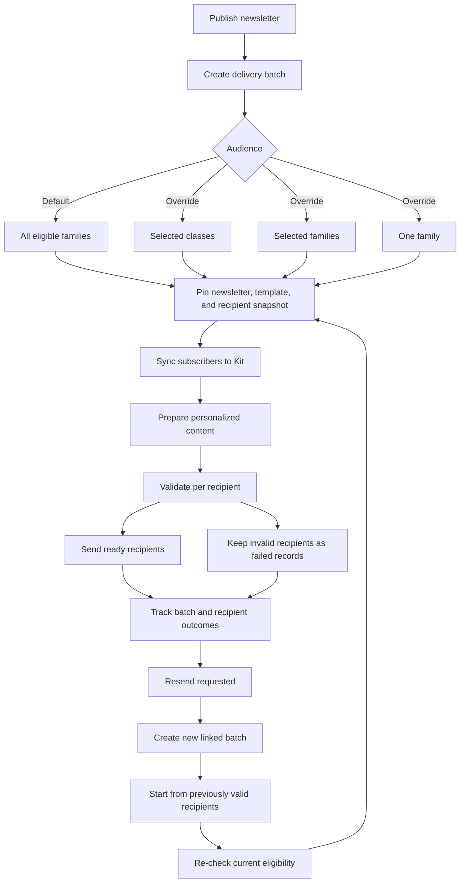
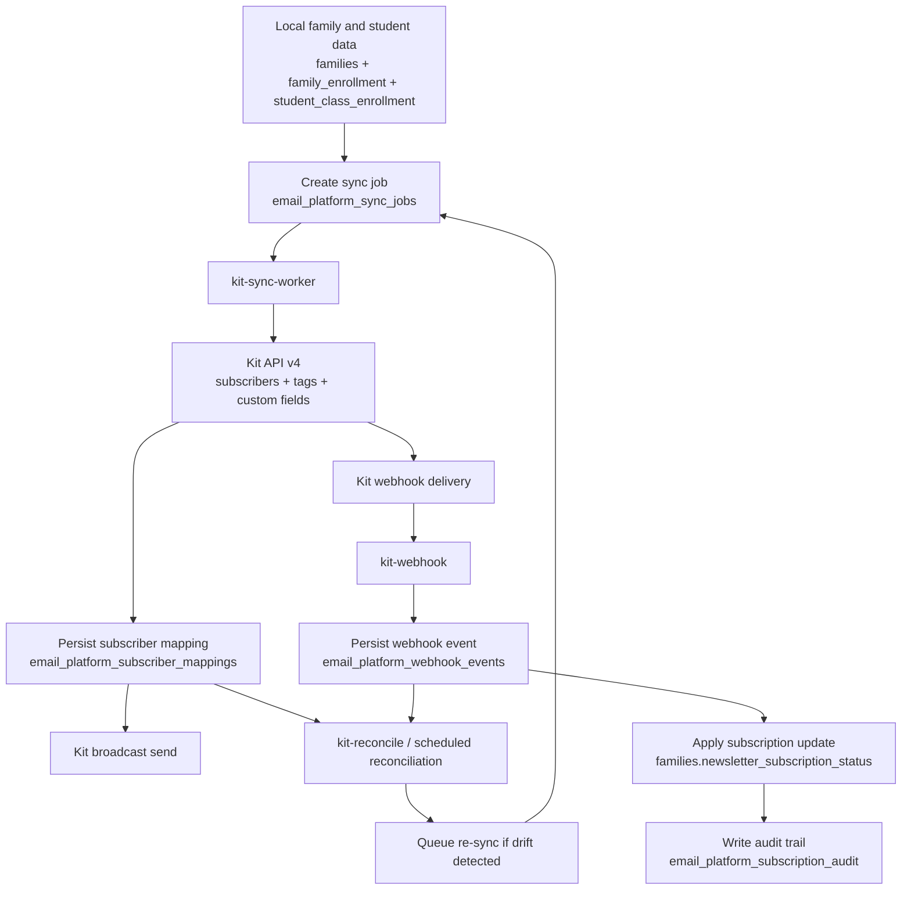

# Email Platform Operations

## Delivery Mental Model



This document currently covers the implemented Kit sync and webhook foundation. As newsletter-delivery orchestration is added, the delivery batch should become the operator's main unit of work, with Kit subscriber sync and webhook reconciliation remaining supporting mechanics underneath it.

## Goal: Send The 1st Email

Use this as the working checklist for the first successful Kit send.

### Progress

- Current status: `7/10` complete
- First test email received: `yes`
- Update rule: change each `- [ ]` to `- [x]` as the step is finished

### First Email Checklist

- [x] 1. Set Edge Function secrets: `KIT_API_TOKEN` or `KIT_API_KEY`, plus `KIT_WEBHOOK_SECRET`.
- [ ] 2. Optionally set `KIT_CLASS_TAG_PREFIX` if you do not want the default `class:`.
- [x] 3. Deploy the new Supabase Edge Functions: `kit-sync-worker`, `kit-webhook`, `kit-replay`, and `kit-reconcile`.
- [x] 4. Apply the migration `supabase/migrations/20260319000400_add_email_platform_integration.sql`.
- [ ] 5. Create a Kit webhook pointing to `https://<project-ref>.supabase.co/functions/v1/kit-webhook?secret=<KIT_WEBHOOK_SECRET>`.
- [x] 6. Confirm one local family is eligible: active family, real `guardian_email`, and at least one active row in `student_class_enrollment`.
- [x] 7. Insert one row into `email_platform_sync_jobs` with `job_type = 'upsert_subscriber'` and `status = 'pending'`.
- [x] 8. Call `POST /functions/v1/kit-sync-worker` to process the first sync job.
- [x] 9. Verify the subscriber in Kit has the expected email, class tag, and custom fields: `child_classes`, `child_names`, `parent_type`.
- [x] 10. Create and send the first broadcast in Kit UI using the synced subscriber or tag. Delivery confirmed.

### Quick SQL For Step 7

```sql
insert into public.email_platform_sync_jobs (
  family_id,
  provider,
  job_type,
  status,
  enqueue_reason,
  payload
) values (
  '<family-uuid>',
  'kit',
  'upsert_subscriber',
  'pending',
  'manual_first_send',
  '{}'::jsonb
);
```

### Notes While Progressing

- This implementation syncs contacts, tags, and custom fields to Kit first.
- The actual email send still happens from Kit.
- If a step fails, check `email_platform_sync_jobs`, `email_platform_subscriber_mappings`, and `email_platform_webhook_events`.

## Required Configuration

Set these server-side environment variables anywhere the Supabase Edge Functions run:

- `KIT_API_TOKEN` or `KIT_API_KEY` or `KIT_API_SECRET`: Kit API credential used for subscriber, tag, and custom-field sync.
- `KIT_WEBHOOK_SECRET`: Shared secret required by the `kit-webhook` function. Provide it as the `x-kit-webhook-secret` header or `?secret=` query parameter from Kit.
- `KIT_API_BASE_URL`: Optional. Defaults to `https://api.kit.com`.
- `KIT_CLASS_TAG_PREFIX`: Optional. Defaults to `class:`.
- `KIT_MAX_ATTEMPTS`: Optional. Defaults to `5`.
- `KIT_INITIAL_RETRY_DELAY_MS`: Optional. Defaults to `60000`.
- `KIT_MAX_RETRY_DELAY_MS`: Optional. Defaults to `3600000`.
- `KIT_WORKER_BATCH_SIZE`: Optional. Defaults to `25`.
- `KIT_RECONCILIATION_BATCH_SIZE`: Optional. Defaults to `50`.

## Worker Entry Points

- `kit-sync-worker`: Processes pending outbound sync jobs and retryable jobs.
- `kit-webhook`: Verifies the shared secret, stores the webhook event, and then processes it idempotently.
- `kit-replay`: Resets failed or dead-lettered jobs/events so they can run again.
- `kit-reconcile`: Reprocesses retryable or unresolved webhook events and runs scheduled reconciliation jobs.

## Deployment Modes

### Local Dev

Use this mode for development, payload testing, and first-pass webhook verification.

- Start local Supabase: `supabase start`
- Serve functions locally: `supabase functions serve --env-file .env`
- Expose local port `54321` with a public tunnel such as `ngrok http 54321`
- Point Kit webhook target URL to:

```text
https://<your-ngrok-domain>/functions/v1/kit-webhook?secret=<KIT_WEBHOOK_SECRET>
```

- Keep both the local functions server and the tunnel running while Kit sends webhook traffic
- Local function requests usually need Supabase gateway headers when called manually with `curl`, but Kit webhook delivery only needs the public URL plus the shared secret

### Zeabur / Self-Hosted Supabase

Use this mode for stable hosted testing or production-like operation.

- Deploy your Supabase stack so Edge Functions are available on a public HTTPS domain
- Set the same server-side env vars on Zeabur:
  - `KIT_API_TOKEN`
  - `KIT_WEBHOOK_SECRET`
  - required Supabase server variables for your self-hosted stack
- Point Kit webhook target URL to:

```text
https://<your-zeabur-domain>/functions/v1/kit-webhook?secret=<KIT_WEBHOOK_SECRET>
```

- This removes the need for `ngrok` and gives Kit a stable callback URL
- Recommended: keep outbound workers private/internal and expose only `kit-webhook` publicly

### Important Gateway Note

- Kit will not send Supabase auth headers like `apikey` or `Authorization`
- For hosted webhook delivery to work, `kit-webhook` must be reachable publicly without requiring a Supabase JWT from Kit
- The webhook is protected by HTTPS plus `KIT_WEBHOOK_SECRET`, which this implementation validates via `x-kit-webhook-secret` or `?secret=`

## Operational Flow

1. Outbound sync jobs are stored in `email_platform_sync_jobs`.
2. Successful syncs update `email_platform_subscriber_mappings` with the latest external subscriber id, payload fingerprint, and provider version marker.
3. Webhooks are first stored in `email_platform_webhook_events`, then applied to local family subscription state.
4. Every local subscription transition is appended to `email_platform_subscription_audit`.
5. A `pg_cron` schedule enqueues reconciliation jobs every 30 minutes for stale mappings.

## System Flow Chart



## Failure Triage

- Check `email_platform_sync_jobs` for rows in `retryable`, `failed`, or `dead_lettered`.
- Check `email_platform_webhook_events` for rows in `retryable`, `unresolved`, `failed`, or `dead_lettered`.
- Review `last_error_code`, `last_error_message`, `attempt_count`, `mismatch_reason`, and `metrics`.
- Use the structured JSON logs emitted by the Edge Functions to inspect throughput, retries, and dead-letter totals.

## Replay Procedures

Replay specific records:

```json
POST /functions/v1/kit-replay
{
  "jobIds": ["<sync-job-id>"],
  "webhookEventIds": ["<webhook-event-id>"]
}
```

Replay every failed record:

```json
POST /functions/v1/kit-replay
{
  "replayAllFailed": true
}
```

## Reconciliation Procedures

- Trigger the worker directly after a bulk local import or family/class cleanup:

```json
POST /functions/v1/kit-reconcile
{
  "limit": 50
}
```

- The scheduled reconciliation job will also enqueue `reconcile_subscriber` work automatically every 30 minutes.
- When reconciliation detects drift in subscriber state, custom fields, or class tags, it enqueues a fresh `upsert_subscriber` job for the affected family.

## Webhook Notes

- Kit’s current public docs describe webhook delivery payloads but do not document a signed request header.
- This implementation therefore uses a required shared secret gate (`x-kit-webhook-secret` header or `?secret=` query parameter) and persists only validated events.
